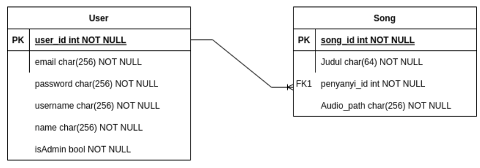

# Tugas Besar 2 IF3110 - HaBeDe - Binotify REST Service
## Deskripsi Web Service

*Web service* pada *repository* ini dibuat sebagai *web service* REST untuk aplikasi Binotify. *Service-service* yang dilakukan antara lain adalah: melakukan autentikasi pengguna; menyediakan *endpoint* bagi penyanyi pada Premium App agar dapat menambahkan, mengubah, menghapus, dan melihat detail lagu; menyediakan *endpoint* untuk melakukan *read/fetch* daftar penyanyi; dan menyediakan *endpoint* untuk melakukan *read/fetch* daftar dari lagu penyanyi.

## Skema Basis Data
 

## Pembagian Tugas
* Autentikasi Pengguna: `13520160` 
* Endpoint Olah Lagu: `13520133, 13520160` 
* Endpoint Daftar Penyanyi: `13520133, 13520160` 
* Endpoint Daftar Lagu Penyanyi: `13520154, 13520160` 